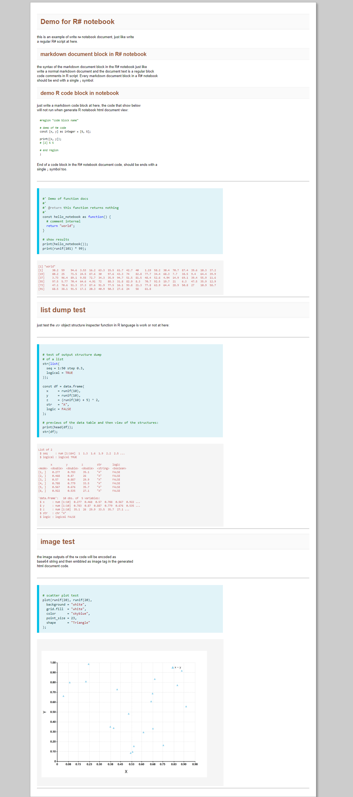

# R Language Server

R# language server for vscode UI and notebook interpreter and html renderer

the entire notebook for R# language is a valid R# script, which can be running in R# environment directly.

## Syntax

### 1. markdown comment supports

markdown document in R# notebook is a kind of regular R# language comment block. But please notice that, only the top level comment will be treated as markdown document. the comments inside any R# closure code will be treated as normal code comments.

```R
# This is a markdown document block.
# any regular R# code comment text in the top level R# script 
# will be treated as markdown document code.
# the prefix of the R# comment hash symbol will be removed from 
# rendering of the markdown document to html view automatically.
;
```

block comment in R# notebook should be end with a single ``;`` terminator character.

### 2. R# code

any non-comment part will be treated as normal R# code when displayed in the notebook.

```
#region "code"
code_here();
#end region
;
```

## Demo screenshot

